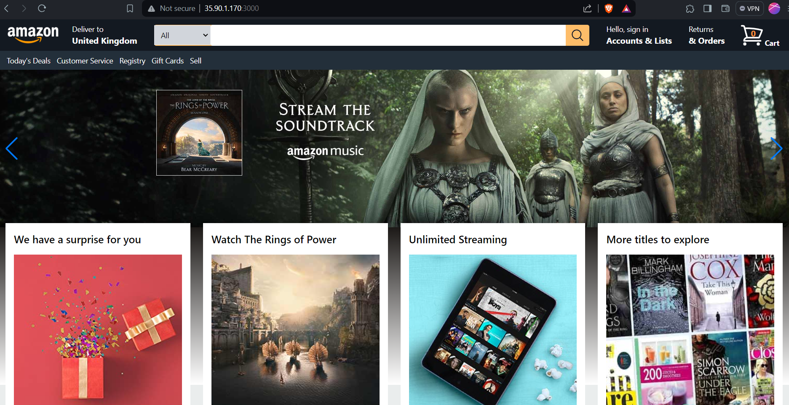

# Amazon App Deployment: A DevSecOps Approach with Terraform and Jenkins CI/CD

Overview :

This project showcases an end-to-end deployment pipeline for the Amazon app, employing a robust DevSecOps approach. Utilizing Jenkins as the orchestrator, alongside essential DevOps tools like Trivy, OWASP, Docker, SonarQube, Terraform, and Shell Scripting, this pipeline ensures rapid, secure, and high-quality deployment.

Tools Used :

* Jenkins: Automation server for CI/CD pipeline management.
* Trivy: Container vulnerability scanner for enhanced security.
* OWASP: Industry-standard security testing for web applications.
* Docker: Containerization for portability and consistency.
* SonarQube: Code quality analysis to maintain high standards.
* Terraform: Infrastructure as code for scalable and reproducible deployments.
* Shell Scripting: Automation scripting for various tasks within the pipeline.

Deployment Process:

1) Terraform Infrastructure Setup:
Provision an AWS EC2 instance for hosting Jenkins and SonarQube.
Configure security groups to allow necessary traffic.
Execute shell scripts for software installations and setup.

2) Jenkins Pipeline: Utilize Jenkins declarative pipeline syntax for clear and organized stages.

3) CI/CD Pipeline Stages:

* Checkout: Fetch the latest code from the repository.
* Sonarqube: Run code analysis with SonarQube for code quality assessment.
* Quality Gate: Wait for the SonarQube quality gate to ensure code meets defined   standards.
* OWASP Scan: Perform security testing using OWASP to identify vulnerabilities.
* Trivy FS Scan: Scan the filesystem with Trivy for container security.
* Docker Build and Push: Build Docker image and push to DockerHub for deployment.
* trivy Image Scan : To scan the built image with trivy .
* Deploy to Container: Run the Docker container on the EC2 instance forproduction   use.

In this age of digital transformation, safeguarding your applications is no longer an option but a necessity. The synergy of Terraform, Jenkins, SonarQube, and Trivy empowers us to not only deploy our applications with speed and efficiency but also to do so with an unwavering focus on security.

this is the containerzied app :
